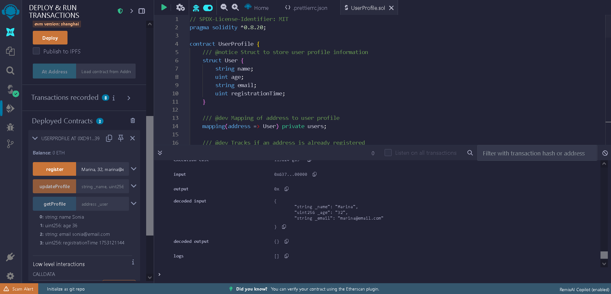
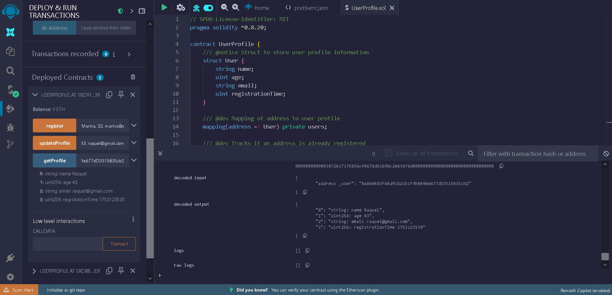

# 🧾 UserProfile Smart Contract

A Solidity smart contract that allows users to register, update, and retrieve their profile information (name, age, email) onchain.

Built using [Cursor](https://www.cursor.so/) and tested with [Remix IDE](https://remix.ethereum.org/).

---

## ✨ Features

- Register with name, age, and email
- Update existing profile information
- Fetch user profile by wallet address
- Prevent duplicate registrations
- Track registration timestamp using `uint`
- Emit events on register and update

---

## 🛠️ Built With

- Cursor – for writing and managing Solidity code
- [Remix IDE](https://remix.ethereum.org/) – for testing and simulation
- Solidity `^0.8.20`

---

## 📄 Contract Overview

The contract uses a `User` struct and two mappings:


struct User {
  string name;
  uint age;
  string email;
  uint registrationTime;
}

## 📄 Main Functions

| Function                                             | Description                                       |
|------------------------------------------------------|---------------------------------------------------|
| `register(string name, uint age, string email)`      | Registers a new user profile                      |
| `updateProfile(string name, uint age, string email)` | Updates the caller's profile                      |
| `getProfile(address user)`                           | Returns name, age, email, and timestamp of a user |

---

## 🧪 Testing in Remix

This contract was tested using **Remix VM (Prague)** in the browser. No real ETH or wallet needed.

### Steps to test:

1. Open [Remix](https://remix.ethereum.org/)
2. Create a new file: `UserProfile.sol`
3. Paste the contract code
4. Compile using Solidity `^0.8.20`
5. Deploy using **Remix VM (Prague)**
6. Use the interface to interact with the contract

---

## 📝 Example Test Flow

### 1. Register a User

```solidity
register("Marina", 32, "marina@email.com")
```




### 2. Update your profile

```solidity
updateProfile("Raquel", 43, "raquel@gmail.com")
```


### 3. Get Profile Info

```solidity
getProfile(0xYourRemixAddress)
```



---

## 📁 Project Structure
```
profile-smart-contract/
├── UserProfile.sol
├── README.md
├── .gitignore
└── images/
├── RegisterSolidityRemix.png
├── UpdateSolidityRemix.png
└── GetAddressSolidityRemix.png
```
---

## 👩‍💻 Author

Sonia Vera Gallego


[@douxxiie](https://x.com/Douxxiie) · [Dev3Pack fellow](https://dev3pack.xyz/) · Building on [Base](https://www.base.org/) and [Farcaster](https://farcaster.xyz/)
